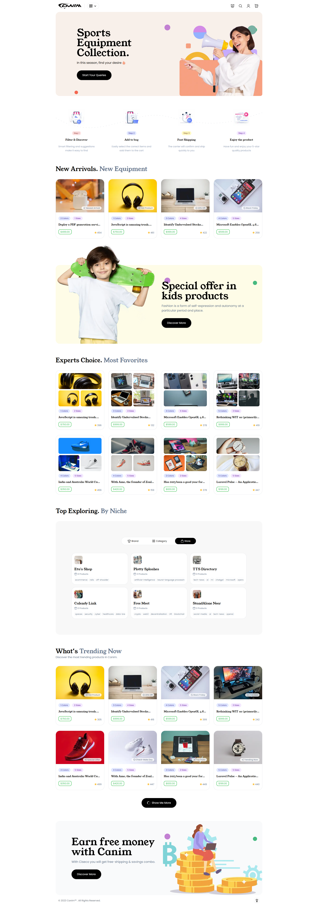

Full Video on YouTube [CodeCraftMERN](https://youtu.be/0A_tPdRdkDw)

# Canim eCommerce

> Discover a seamless shopping experience at our e-commerce haven. Browse an extensive selection of products from top brands, enjoy secure transactions, and relish swift deliveries. Elevate your online shopping journey with user-friendly navigation and exclusive deals. Shop effortlessly, anytime, anywhere, and redefine convenience with our digital marketplace.

## Overview

Explore curated deals and trending products on our inviting e-commerce homepage. Instantly find what you need for a delightful shopping experience.



## Features

### Pages

- Total `x31` Pages
  - Home `x1`
  - Detail `x1`
  - Filter `x1`
  - Auth `x3`
  - Dashboard `x3`
    - Buyer `x5` `cart & favorites`
    - Seller `x8` `CRUD intension`
    - Admin `x10` `CRUD intension`

### Modals

- Total `x15` Modals
  - Category `x1`
  - Brand `x1`
  - Store `x1`
  - Search `x1`
  - Cart `x1`
  - Auth `x1`
  - Buyer `x2`
  - Seller `x2`
  - Admin `x5`

### Core

- Real-Time interaction `cart`, `favorites`, `create`, `read`, `update` & `delete`
- Separate Dashboard panel `admin`, `seller` & `buyer`
- Advance search filter `highlight matched words & letters`
- Image preview `avatar`, `thumbnail` & `gallery`
- Responsive design `pc`, `laptop`, `tablet` & `mobile`
- Payment gateway `stripe`
- Intuitive user-friendly design `ui/ux`
- Secure channel bypass `role based`

## Tech Stack

- Framework: `Next.Js 13 App Directory`
- State Container: `Redux Toolkit`
- Styling: `Tailwind CSS`
- Icons: `React Icons`
- Database: `MongoDB`
- ORM: `Mongoose`
- Linting: `ESLint`
- Formatter: `Prettier`
- Work Management: `Asana`
- Backend Directory: `Node.Js Express Server`

## Technologies

| Client                  | Server                    |
| ----------------------- | ------------------------- |
| @reduxjs/toolkit        | bcryptjs                  |
| autoprefixer            | cloudinary                |
| eslint                  | colors                    |
| eslint-config-next      | cors                      |
| next                    | dotenv                    |
| postcss                 | express                   |
| react                   | jsonwebtoken              |
| react-dom               | mongoose                  |
| react-icons             | multer                    |
| react-redux             | multer-storage-cloudinary |
| tailwind-scrollbar-hide | validator                 |
| tailwindcss             | nodemon                   |
| @tailwindcss/forms      |

# Development

## Clone Repository

You can use any package manager like `npm` or `yarn`

```bash
git clone https://github.com/devhasibulislam/canim-ecommerce.git
cd canim-ecommerce

cd client
yarn install

cd ..

cd server
yarn install
```

## Environment Setup

### Client Side

```bash
NEXT_PUBLIC_BASE_URL="http://localhost:8080/api"
```

### Server Side

```bash
# Port number
PORT=8080

# Origin URL
ORIGIN_URL="http://localhost:3000"

# MongoDB Atlas URI
DB_Name="canim-template"
ATLAS_URI="YOUR_MONGODB_ATLAS_URI"

# JWT secret
TOKEN_SECRET="JWT_TOKEN"

# Cloudinary credentials
CLOUD_NAME="CLOUDINARY_CLOUD_NAME"
API_KEY="CLOUDINARY_API_KEY"
API_SECRET="CLOUDINARY_API_SECRET"

# Stripe Payment Credentials
STRIPE_PUBLISHABLE_KEY="YOUR_STRIPE_PUBLISHABLE_KEY"
STRIPE_SECRET_KEY="YOUR_STRIPE_SECRET_KEY"
```
# Access
- Buyer `demo@example.com` & `Demo@123`
- Seller `devhasibulislam@gmail.com` & `Hasib@123`
- Admin `admin@example.com` & `Admin@123` => `don't create any occurrence :(`

# Important Links

- [x] `Client Side` Live Link: [Click Here](https://canim-csr.vercel.app/)
- [x] `Server Side` Live Link: [Click Here](https://canim-ssr.vercel.app/)
- [x] `Dashboard Reference` Link: [Click Here](https://loopinfosol.in/themeforest/ekka-html-v33/ekka-admin/index.html)
- [x] `Reference Site` Live Link: [Click Here](https://chisnghiax.com/ciseco/)

# Author

- Developer: [Hasibul Islam](https://bento.me/devhasibulislam)
- Designer: [Sadia Khanum](https://www.facebook.com/devsadiakhan) `dedicate to`

# `find it useful` then `buy me a coffee` 😜😜😜

<a href="https://www.buymeacoffee.com/devhasibulislam" target="_blank">
    
</a>
